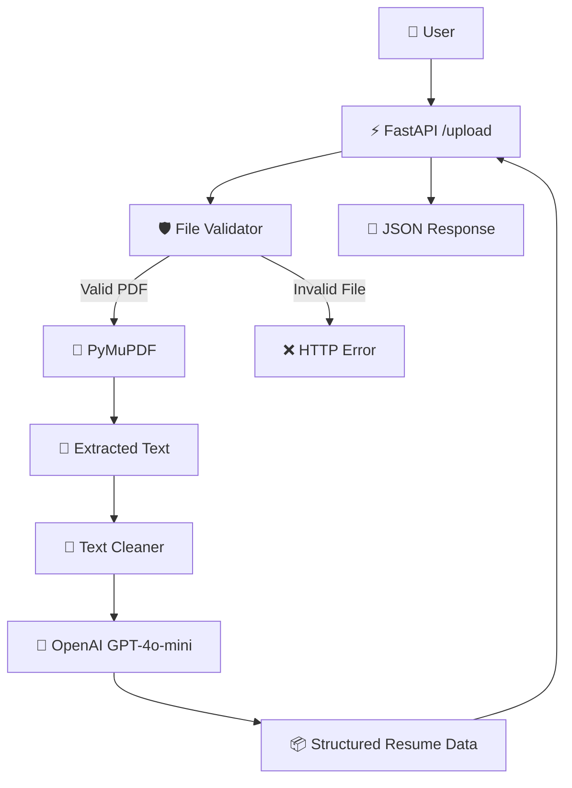

# 🧠 ResuMind AI

<p align="center">
  <b>🤖 AI-Powered Resume Parser using FastAPI, PDF Processing & OpenAI</b>
</p>

<p align="center">
  
  
  
  
</p>

---

## 🌟 Overview

**ResuMind AI** is an AI-powered resume parsing backend that converts an uploaded PDF resume into structured information.

Instead of manually reading a resume, the application automatically:

- 📄 Accepts a resume in PDF format
- ✅ Validates the uploaded file
- 🔎 Extracts text from the PDF
- 🧹 Cleans and normalizes the extracted text
- 🤖 Sends the processed text to an OpenAI model
- 📋 Extracts important candidate information
- 📦 Returns the result as JSON

The current implementation focuses on the **resume upload and AI-powered parsing pipeline**.

---

## ✨ Key Features

### 📤 1. Resume Upload

Users can upload a resume through the `/upload` API endpoint.

The application currently accepts:

- 📄 PDF files only
- 📦 Maximum file size: **2 MB**
- 🚫 Empty files are rejected

---

### 🛡️ 2. File Validation

Before processing the resume, the backend validates the uploaded file.

Validation includes:

| Validation | Rule |
|---|---|
| 📄 File type | PDF only |
| 📦 File size | Maximum 2 MB |
| 🚫 Empty file | Not allowed |

This prevents unsupported or invalid files from entering the processing pipeline.

---

### 📄 3. PDF Text Extraction

The project uses **PyMuPDF (`fitz`)** to read the uploaded PDF.

The text from each PDF page is extracted and combined into a single text string.

```text
Resume PDF
    │
    ▼
📄 PyMuPDF
    │
    ▼
Extracted Resume Text
```

If no readable text is found, the API returns an extraction error.

---

### 🧹 4. Text Cleaning

Before sending the resume to the LLM, the extracted text is cleaned.

The current cleaning process:

- Converts text to lowercase
- Removes extra whitespace
- Removes unsupported special characters
- Keeps basic characters such as letters, numbers, `@`, and `.`
- Removes leading/trailing spaces

```text
Raw PDF Text
     │
     ▼
🔤 Lowercase
     │
     ▼
🧹 Remove Extra Spaces
     │
     ▼
✂️ Clean Special Characters
     │
     ▼
Clean Resume Text
```

---

### 🤖 5. AI Resume Parsing

The cleaned resume text is sent to **OpenAI GPT-4o-mini**.

The model is instructed to extract:

- 👤 Name
- 📧 Email
- 🛠️ Skills
- 🎓 Education
- 💼 Experience

The application asks the model to return the extracted information in JSON format.

---

## 🏗️ System Architecture



---

## 🔄 Resume Processing Pipeline

```text
                    📄 Resume PDF
                         │
                         ▼
                ┌─────────────────┐
                │ 🛡️ Validate File │
                └────────┬────────┘
                         │
                         ▼
                ┌─────────────────┐
                │ 📄 Extract Text │
                │    PyMuPDF      │
                └────────┬────────┘
                         │
                         ▼
                ┌─────────────────┐
                │ 🧹 Clean Text   │
                └────────┬────────┘
                         │
                         ▼
                ┌─────────────────┐
                │ 🤖 OpenAI LLM   │
                │   GPT-4o-mini   │
                └────────┬────────┘
                         │
                         ▼
                ┌─────────────────┐
                │ 📋 Parsed Data  │
                └─────────────────┘
```

---

## 🛠️ Tech Stack

### 🐍 Backend

- **Python**
- **FastAPI**
- **Uvicorn** for serving the API

### 📄 Document Processing

- **PyMuPDF (`fitz`)** for PDF text extraction

### 🧹 Text Processing

- **Python Regular Expressions (`re`)**
- Text normalization and cleaning

### 🤖 AI

- **OpenAI API**
- **GPT-4o-mini**

---

## 📁 Project Structure

```text
ResumindAi.io-main/
│
├── 📄 main.py
│
├── 📂 services/
│   ├── llm_parser.py
│   └── pdf_extractor.py
│
├── 📂 utils/
│   └── text_cleaner.py
│
├── 📂 validators/
│   └── file_validator.py
│
└── 📂 .sfdx/
    └── Salesforce-related generated metadata
```

### 📌 Main Components

| File | Responsibility |
|---|---|
| `main.py` | FastAPI application and `/upload` endpoint |
| `validators/file_validator.py` | PDF type, size, and empty-file validation |
| `services/pdf_extractor.py` | Extracts text from PDF using PyMuPDF |
| `utils/text_cleaner.py` | Cleans and normalizes extracted text |
| `services/llm_parser.py` | Sends resume text to OpenAI and parses candidate details |

---

## 🚀 Getting Started

### 📌 Prerequisites

Make sure you have:

- 🐍 Python 3.10+
- 📦 pip
- 🔑 OpenAI API key

---

## ⚙️ Installation

### 1️⃣ Clone the repository

```bash
git clone <your-repository-url>
cd ResumindAi.io-main
```

### 2️⃣ Create a virtual environment

#### Windows

```bash
python -m venv venv
venv\Scripts\activate
```

#### macOS / Linux

```bash
python3 -m venv venv
source venv/bin/activate
```

### 3️⃣ Install dependencies

The project requires the packages used by the Python modules:

```bash
pip install fastapi uvicorn python-multipart pymupdf openai
```

> 💡 It is recommended to create a `requirements.txt` file for reproducible installation.

---

## 🔐 Configure OpenAI API Key

Create a `.env` file:

```env
OPENAI_API_KEY=your_openai_api_key
```

Then update the OpenAI client in `services/llm_parser.py` to read the key from the environment instead of storing it directly in source code.

### ⚠️ Security Warning

**Never commit an API key to GitHub.**

The current project ZIP contains an API credential directly inside `services/llm_parser.py`. Before publishing this repository:

1. 🔄 Rotate/revoke the exposed API key.
2. 🔐 Create a new API key.
3. 📁 Store it in `.env`.
4. 🚫 Add `.env` to `.gitignore`.
5. 🔧 Load the key using an environment variable.

Example:

```python
import os
from openai import OpenAI

client = OpenAI(
    api_key=os.getenv("OPENAI_API_KEY")
)
```

---

## ▶️ Run the Application

Start the FastAPI server:

```bash
uvicorn main:app --reload
```

The API will normally run at:

```text
http://127.0.0.1:8000
```

FastAPI interactive documentation:

```text
http://127.0.0.1:8000/docs
```

---

## 🔌 API Reference

### 📤 Upload Resume

```http
POST /upload
```

Upload a PDF resume using multipart form data.

### Request

```text
file: resume.pdf
```

### Processing

```text
PDF
 ↓
Validation
 ↓
Text Extraction
 ↓
Text Cleaning
 ↓
GPT-4o-mini
 ↓
Resume Information
```

### Example Response

```json
{
  "filename": "resume.pdf",
  "parsed_data": {
    "name": "Candidate Name",
    "email": "candidate@example.com",
    "skills": [
      "Python",
      "React",
      "SQL"
    ],
    "education": "...",
    "experience": "..."
  }
}
```

> ℹ️ The exact `parsed_data` value is generated by the LLM and may vary depending on the resume content.

---

## ❌ Error Handling

The API validates the file before processing it.

Possible errors include:

### Unsupported File

```text
Only PDF files are allowed
```

### File Too Large

```text
File too large
```

### Empty File

```text
Empty file
```

### PDF Without Extractable Text

```text
No text found in PDF
```

### PDF Extraction Failure

```text
Error extracting text from PDF
```

---

## 🧪 Example Workflow

Suppose a user uploads:

```text
Divya_Bahekr_Resume.pdf
```

The system processes it as:

```text
📄 Divya_Bahekr_Resume.pdf
             │
             ▼
       🛡️ Validation
             │
             ▼
       📄 PDF Extraction
             │
             ▼
        🧹 Text Cleaning
             │
             ▼
       🤖 GPT-4o-mini
             │
             ▼
      📋 Resume Details
             │
             ▼
          📦 JSON
```

The extracted information can then be used by a future recruitment or resume-analysis layer.

---

## 🎯 Current Scope

The current codebase implements the following core functionality:

```text
✅ PDF Resume Upload
✅ File Validation
✅ PDF Text Extraction
✅ Text Cleaning
✅ AI-Based Resume Parsing
✅ JSON Response
```

The ZIP provided for this project does **not** currently contain implementation for a frontend UI, job-description matching, missing-skill recommendations, recruiter candidate ranking, or a vector database/RAG pipeline.

These can be added as future modules.

---

## 🚧 Future Improvements

### 👤 Candidate Side

- 📊 Resume analysis dashboard
- 🎯 Job Description vs Resume matching
- 📈 Resume match percentage
- 🔍 Missing skills detection
- 📚 Learning-resource recommendations
- ✨ Resume improvement suggestions

### 🧑‍💼 Recruiter Side

- 📤 Upload Job Description
- 👥 Candidate management
- 🏆 Candidate ranking
- 🔎 Skill-based candidate filtering
- 📊 Candidate comparison dashboard

### 🧠 AI Improvements

- 🔗 Add RAG for job and skill knowledge
- 🧠 Add vector embeddings
- ✂️ Improve semantic text chunking
- 🕸️ Add LangChain/LangGraph workflows
- 🎯 Add structured output validation
- 🧪 Add automated LLM evaluation

### 🌐 Application Improvements

- ⚛️ Add React frontend
- 🔐 Add authentication
- 💾 Add database storage
- ☁️ Deploy the application
- 📊 Add analytics

---

## 💡 Why ResuMind AI?

Traditional resume screening requires recruiters to manually read and compare large numbers of resumes.

ResuMind AI aims to make this process faster by using AI to convert unstructured resume documents into structured candidate information.

```text
📄 Unstructured Resume
          ↓
       🤖 AI
          ↓
📋 Structured Candidate Data
          ↓
🎯 Future Recruitment Analysis
```

---

## 🔮 Project Vision

The long-term vision of **ResuMind AI** is to build an intelligent recruitment assistant that can help both candidates and recruiters.

```text
                    🧠 ResuMind AI
                         │
          ┌──────────────┴──────────────┐
          ▼                             ▼
     👤 Candidate                  🧑‍💼 Recruiter
          │                             │
    Resume Analysis              Candidate Screening
          │                             │
    Skill Gap Analysis           JD Matching
          │                             │
 Learning Recommendations       Candidate Ranking
```

---

## 📌 Development Notes

This repository currently represents the **backend resume-parsing component** of the larger ResuMind AI concept.

The architecture is intentionally modular:

```text
main.py
   │
   ├── validators/
   │
   ├── services/
   │
   └── utils/
```

This makes it easier to extend the project with additional AI and recruitment features later.

---

## 👨‍💻 Project

**ResuMind AI**

Built with:

`Python` • `FastAPI` • `PyMuPDF` • `OpenAI GPT-4o-mini`

> 🚀 **Upload. Understand. Structure. Analyze.**

---

<p align="center">
  ⭐ If you find this project useful, consider giving it a star!
</p>
